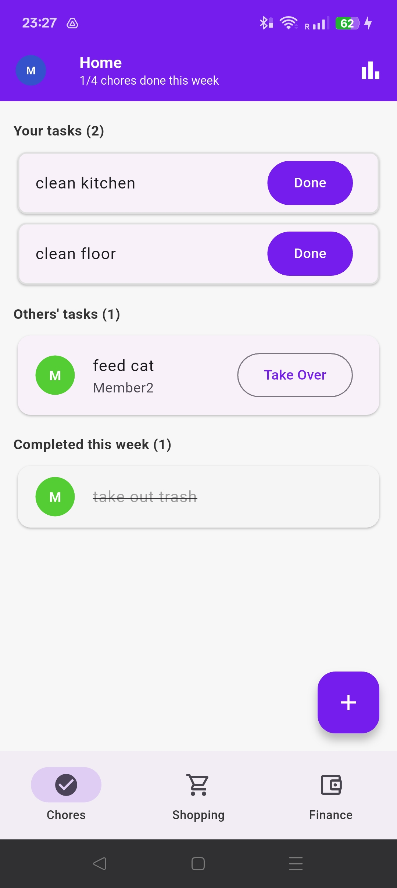
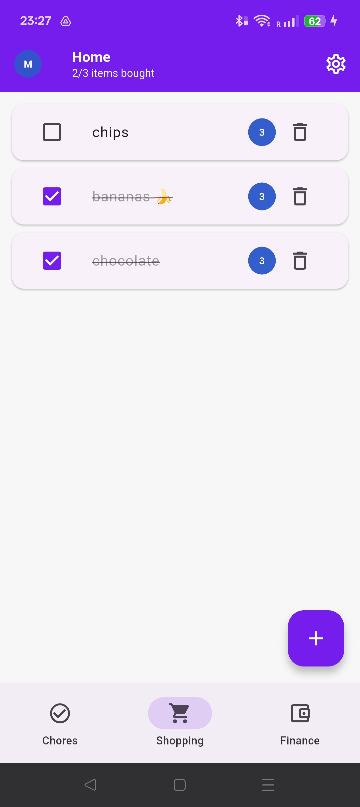
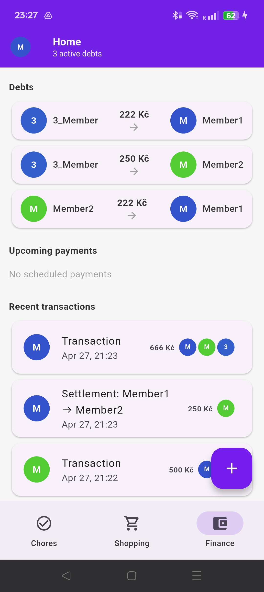
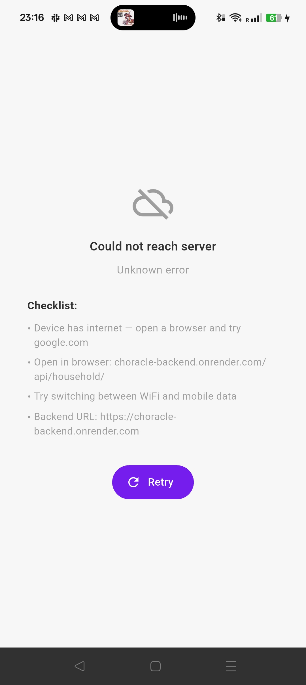

# Choracle — Shared Household Manager

**XPC-MMA Final Project · Martin Szuc (231284)**

A multi-user household management app for Android. Covers chore tracking, a shared shopping list, and shared expense management in one place.

---

## Links

| | |
|---|---|
| **Demo video** | [YouTube Short](https://youtube.com/shorts/p1JijENZFTk?feature=share) |
| **Presentation** | [Google Slides](https://docs.google.com/presentation/d/1jWutQJZBuhMMU7x55qPtToyb9j81pP7IZmwUseL6kx4/edit?usp=sharing) |
| **Overview** | [docs/overview.md](docs/overview.md) — architecture, data model, setup |
| **Backend** | [docs/backend.md](docs/backend.md) — models, endpoints, scheduler |
| **Frontend** | [docs/frontend.md](docs/frontend.md) — state management, screens |

---

## Screenshots

| Chores | Shopping |
|:---:|:---:|
|  |  |

| Finance | Error handling |
|:---:|:---:|
|  |  |

---

## Screen Recordings

Short recordings of each feature flow (MP4, in `docs/gifs/`):

| Recording | Feature |
|---|---|
| [01-add-member.mp4](docs/gifs/01-add-member.mp4) | Adding a new household member |
| [02-add-chore.mp4](docs/gifs/02-add-chore.mp4) | Creating an immediate chore |
| [03-add-scheduled-chore.mp4](docs/gifs/03-add-scheduled-chore.mp4) | Creating a recurring scheduled chore |
| [04-complete-chore.mp4](docs/gifs/04-complete-chore.mp4) | Completing and taking over chores |
| [05-add-transaction.mp4](docs/gifs/05-add-transaction.mp4) | Creating a transaction with participants |
| [06-settle-debt.mp4](docs/gifs/06-settle-debt.mp4) | Settling a debt (full/partial) |
| [07-shopping-list.mp4](docs/gifs/07-shopping-list.mp4) | Shopping list: add items, favorites, purchase |

---

## Features

**Chores**
- One-time and recurring task management
- Weekly task tracking per household member
- Take over tasks from other members
- Completion statistics with charts

**Shopping List**
- Shared list with quantity tracking
- Household favorites for quick adding
- Automatic debt creation on purchase (single or group split)

**Finance**
- Shared expense tracking and debt management
- Recurring payment scheduling
- Full and partial debt settlements
- Transaction history grouped by month

---

## Tech Stack

| Layer | Technology |
|---|---|
| Frontend | Flutter 3 (Android) — Provider, Dio |
| Backend | Django 4 + Django REST Framework |
| Database | PostgreSQL |
| Scheduler | APScheduler + django-apscheduler |
| Deployment | Local (primary) / Render.com (secondary) |

---

## Architecture

```
Flutter App (Android)          Django Backend              PostgreSQL
┌─────────────────────┐       ┌──────────────────┐       ┌──────────┐
│ Screens             │       │ DRF Views        │       │          │
│ Provider Layer      │──REST─│ Serializers      │───────│   DB     │
│ Dio HTTP Client     │ JSON  │ APScheduler ⏰   │       │          │
└─────────────────────┘       └──────────────────┘       └──────────┘
```

AppProvider loads the household, propagates the ID to ChoresProvider, ShoppingProvider, and FinanceProvider via `ChangeNotifierProxyProvider`. Each child provider auto-fetches on ID change.

APScheduler runs at midnight daily: generates chores from `DefaultChore` templates and processes recurring transactions.

---

## Data Model

| Model | Key Fields | Relationships |
|---|---|---|
| **Household** | id, name | Parent of all other models |
| **Member** | name, color | belongs to Household |
| **Chore** | name, completed, week_identifier | assigned_to, original_assigned_to, completed_by → Member |
| **DefaultChore** | name, frequency_days, start_date | assigned_to → Member · generates Chores at midnight |
| **MemberStats** | completed_count, taken_over_count | 1:1 with Member · weekly_history, daily_history (JSON) |
| **ShoppingItem** | name, quantity, purchased, debt_option | created_by → Member · linked_transaction → Transaction |
| **Transaction** | amount, description, is_recurring | creditor → Member · participants (M2M) · spawns Debts |
| **Debt** | amount | creditor, debtor → Member · related_transaction |

Key design decisions:
- **Chore** stores both `assigned_to` and `original_assigned_to` — the delta detects take-overs
- **MemberStats** uses JSON dicts keyed by ISO week/date — no aggregation queries needed
- **Debt** is aggregated with `GROUP BY (debtor, creditor), SUM(amount)` — one net number per pair

---

## Work Packages

| WP | Title | Hours |
|---|---|---|
| WP1 | Backend — Django REST API | 12 h |
| WP2 | Chores Module | 10 h |
| WP3 | Shopping List Module | 10 h |
| WP4 | Finance Module | 14 h |
| WP5 | Presentation & Demo | 15 min |

**WP1 — Backend** · Django REST Framework, PostgreSQL, APScheduler. All CRUD endpoints, CORS, nightly scheduler for recurring chores and transactions. Deployed on Render.

**WP2 — Chores** · Weekly chore screen per member, take-over flow, immediate and scheduled (recurring) chore creation, completion stats with fl_chart charts.

**WP3 — Shopping** · Shared list, household favorites, debt-linking on purchase (single or group split), UI settings (hide purchased, toggle avatars).

**WP4 — Finance** · Transaction CRUD, recurring payment scheduling, debt aggregation, full and partial settlement. Full history grouped by month.

**WP5 — Presentation** · 10 min talk + 3 min demo (recorded) + 2 min Q&A.

---

## Running Locally

### Backend

```bash
cd backend
python -m venv venv
source venv/bin/activate
pip install -r requirements.txt
python manage.py migrate
python manage.py seed_household
python manage.py runserver 0.0.0.0:8000
```

### Frontend

```bash
cd frontend
flutter pub get

# Android emulator
flutter run --dart-define=API_BASE_URL=http://10.0.2.2:8000/api

# Physical device (replace with your LAN IP)
flutter run --dart-define=API_BASE_URL=http://192.168.x.x:8000/api
```

Find your LAN IP: `ipconfig getifaddr en0`

---

## Documentation

- [Overview — architecture, data model, setup](docs/overview.md)
- [Backend — models, endpoints, scheduler](docs/backend.md)
- [Frontend — state management, screens](docs/frontend.md)

---

*Forked from [HouseUP](https://github.com/RomanPoliacik/houseup) — rewritten as Flutter + Django.*
